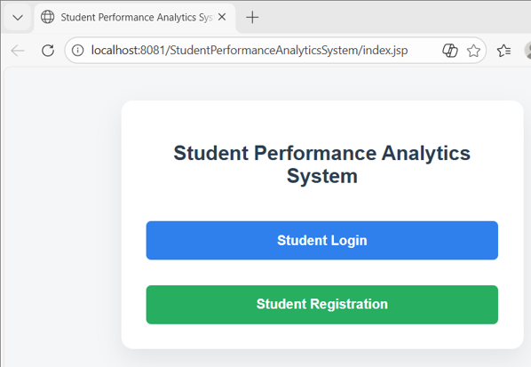
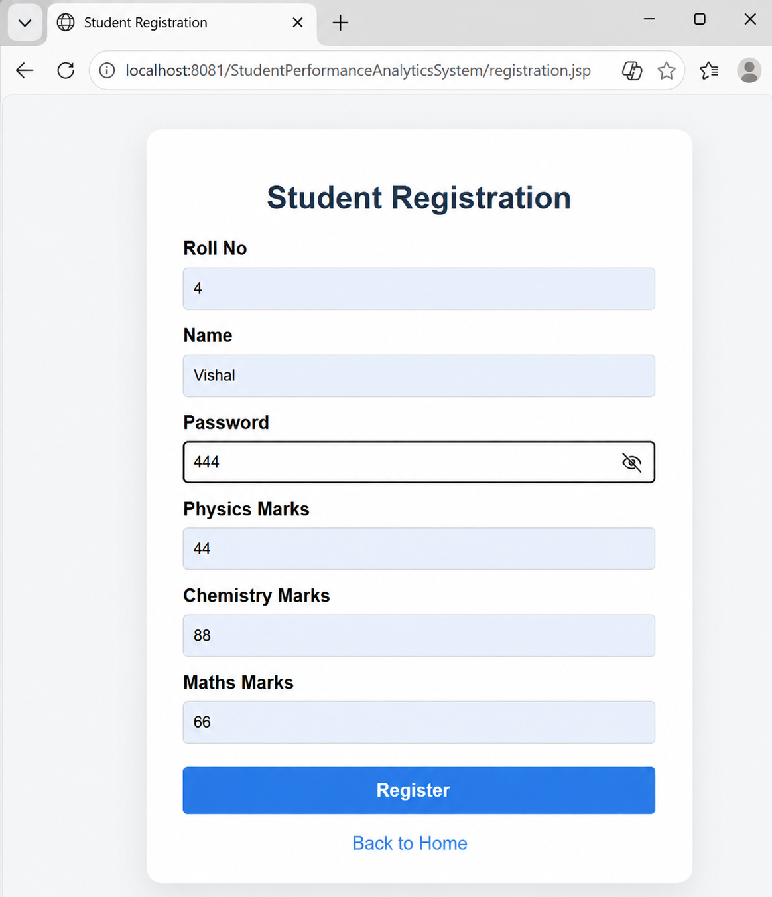
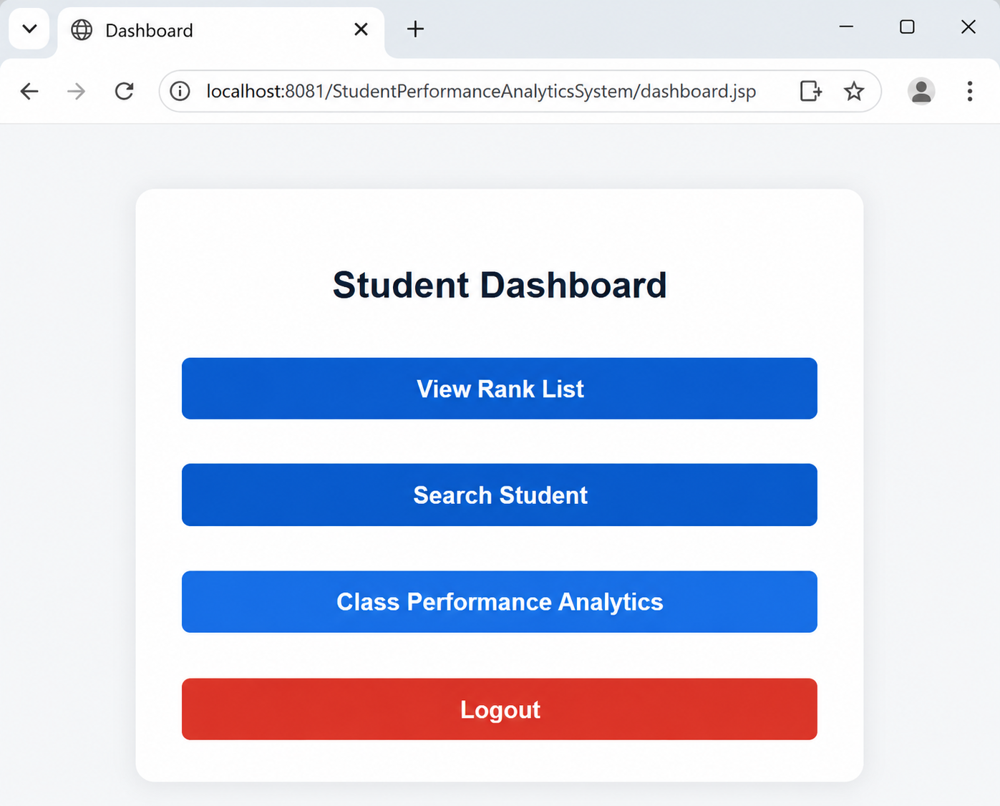
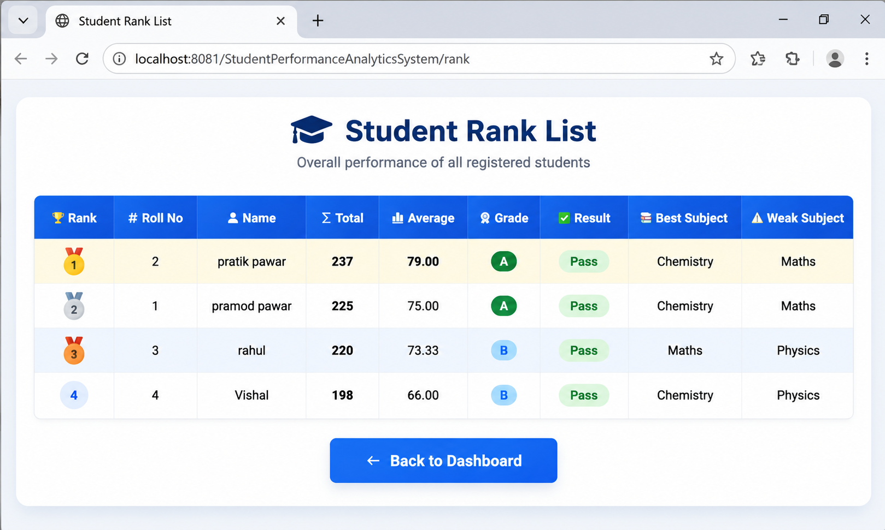
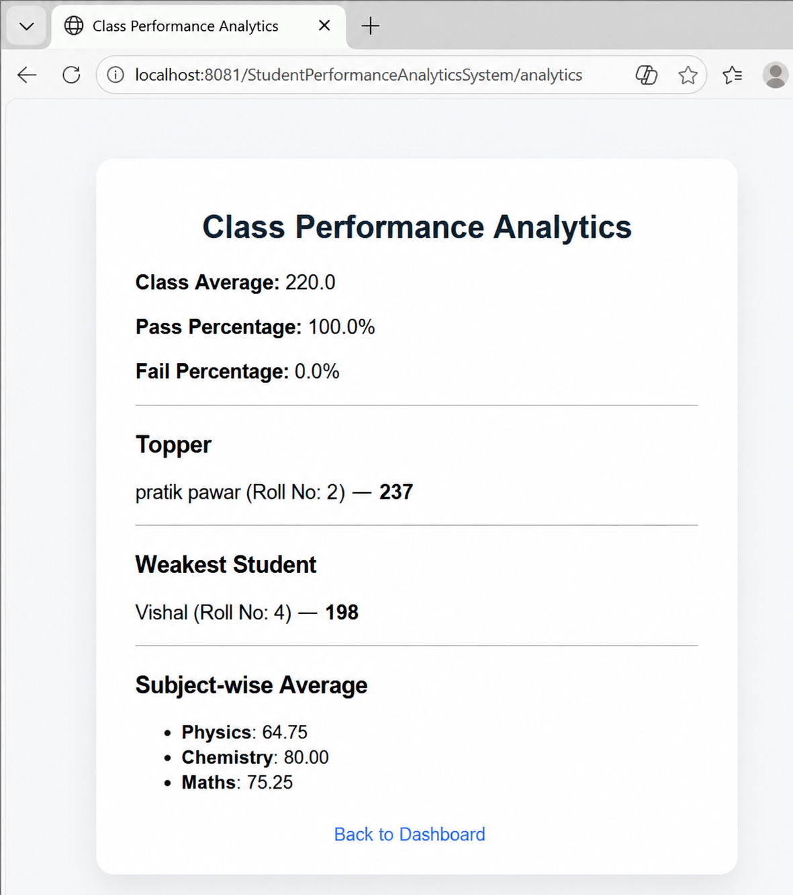

# Student Performance Analytics System

A web-based Student Performance Analytics System developed using Java Servlets, JSP, JDBC, and MySQL.

## Project Overview

This system manages student information and academic performance through a web-based application.

It provides student registration and login, marks management, student search, ranking, and performance analytics.

## Features

- Student registration with academic marks
- Student login and authentication
- Student logout
- Student search
- Student ranking based on total marks
- Performance analytics
- Class average calculation
- Pass/fail percentage analysis
- Topper and weakest student identification
- HashMap-based student data handling
- Database integration using JDBC and MySQL

## Technologies Used

- Java
- JSP (JavaServer Pages)
- Java Servlets
- JDBC
- MySQL
- Apache Tomcat 9
- HTML
- CSS
- Eclipse IDE

## Data Structures and Algorithms

The project uses Java data structures and search techniques for handling student records.

### Data Structures

- `ArrayList` – used for maintaining collections of student records
- `HashMap` – used for student lookup and mapping records by roll number

### Search

- Linear search
- HashMap-based lookup
- Search functionality through Servlets

## Project Structure

```text
StudentPerformanceAnalyticsSystem/
│
├── database/
│   └── student_db.sql
│
├── src/
│   └── main/
│       ├── java/
│       │   └── com/student/
│       │       ├── dao/
│       │       ├── ds/
│       │       ├── model/
│       │       └── web/
│       │
│       └── webapp/
│           ├── WEB-INF/
│           ├── css/
│           ├── analytics.jsp
│           ├── dashboard.jsp
│           ├── hashmapResult.jsp
│           ├── index.jsp
│           ├── login.jsp
│           ├── rank.jsp
│           ├── register.jsp
│           ├── search.jsp
│           └── searchResult.jsp
│
├── .gitignore
└── README.md
```

## Application Screenshots

### Home Page



### Registration



### Dashboard



### Rank List



### Class Performance Analytics



## How to Run

### Prerequisites

- Java
- MySQL
- Apache Tomcat 9
- MySQL Connector/J

### Database Setup

1. Open `database/student_db.sql`.
2. Execute the script in MySQL to create the `student_db` database and `students` table.
3. Update the MySQL username and password in `StudentDAO.java` with your local database credentials.

### Run the Application

1. Import the project into Eclipse.
2. Configure Apache Tomcat 9 as the server.
3. Add the project to the Tomcat server.
4. Start the server.
5. Open the application in a web browser.